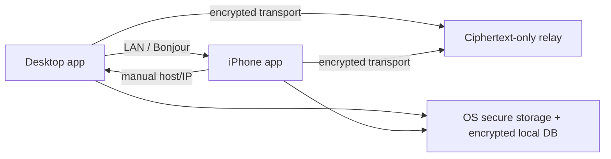

# Architecture

## Current implementation

The working v1 is the existing plain-JavaScript frontend served by Express, with a file-backed development store and SSE. See [Local backend v1](local-backend.md) for implemented contracts. The native/relay architecture below is a future target; it is not implemented by the local server.

## Overview

Clippy is organized around a small shared trust core and platform-specific shells.

## Components

- Desktop shell: device dashboard, clipboard inbox, file transfer, permissions, and connectivity state.
- iPhone shell: devices, files, settings, explicit send/copy flows, and clear background limitations.
- Transport layer: local discovery, manual host pairing, relay fallback, message expiry, replay protection, and queueing.
- Storage: keychain / credential vault for secrets, encrypted local storage for trusted devices and queued items.

## Design principles

- Never claim a background behavior that the OS cannot honestly provide.
- Prefer direct LAN transport when available.
- Fallback to manual host entry before giving up.
- Use relay only as a ciphertext-only recovery path.

